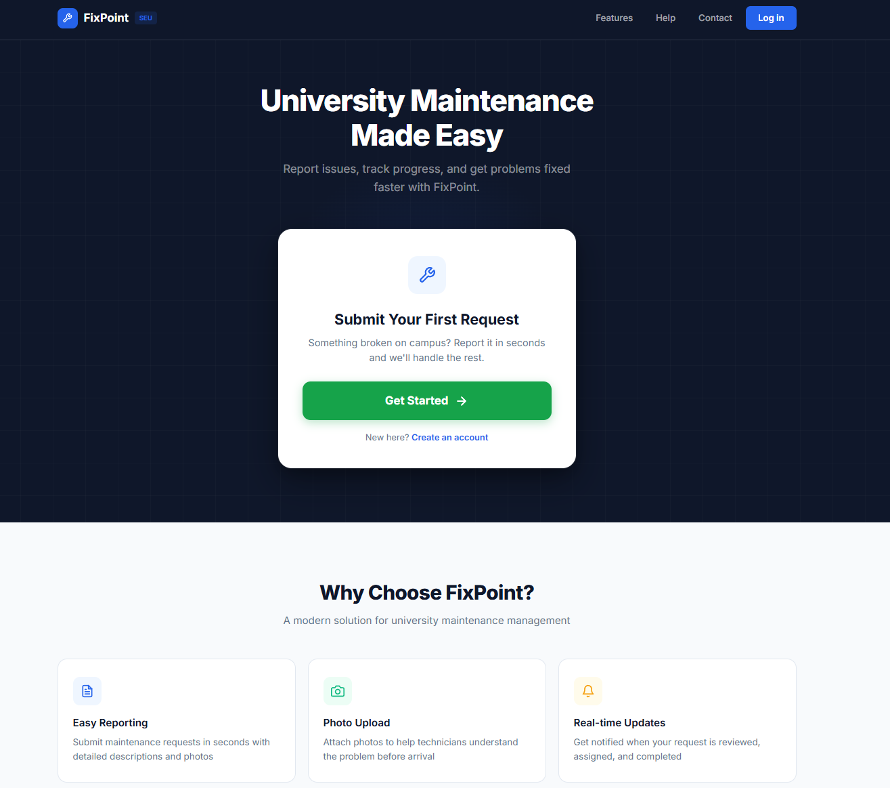
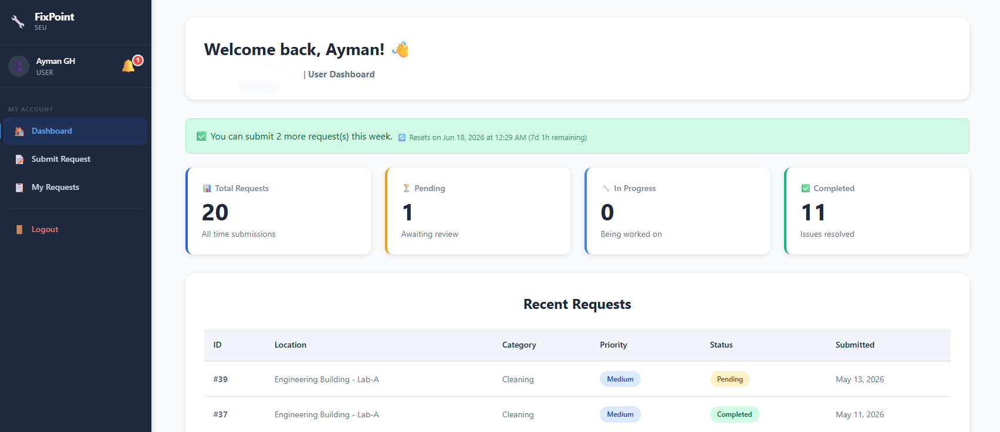
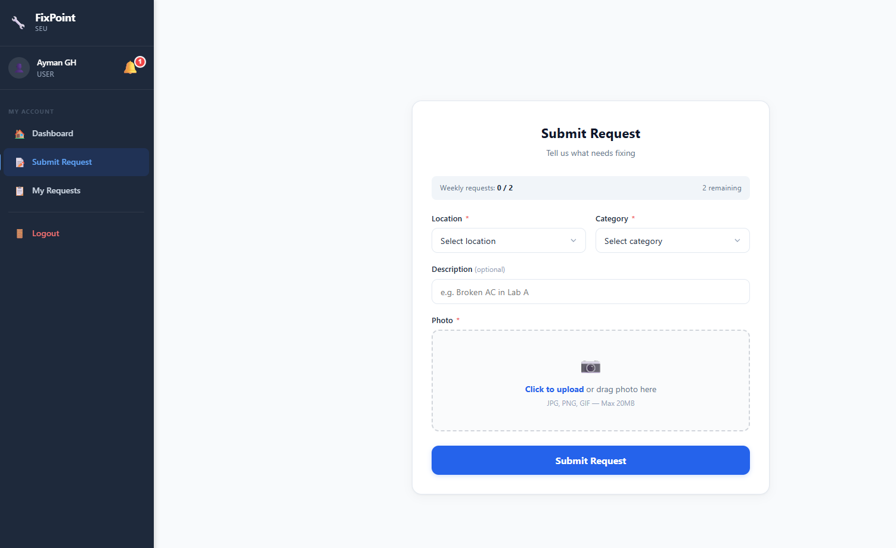
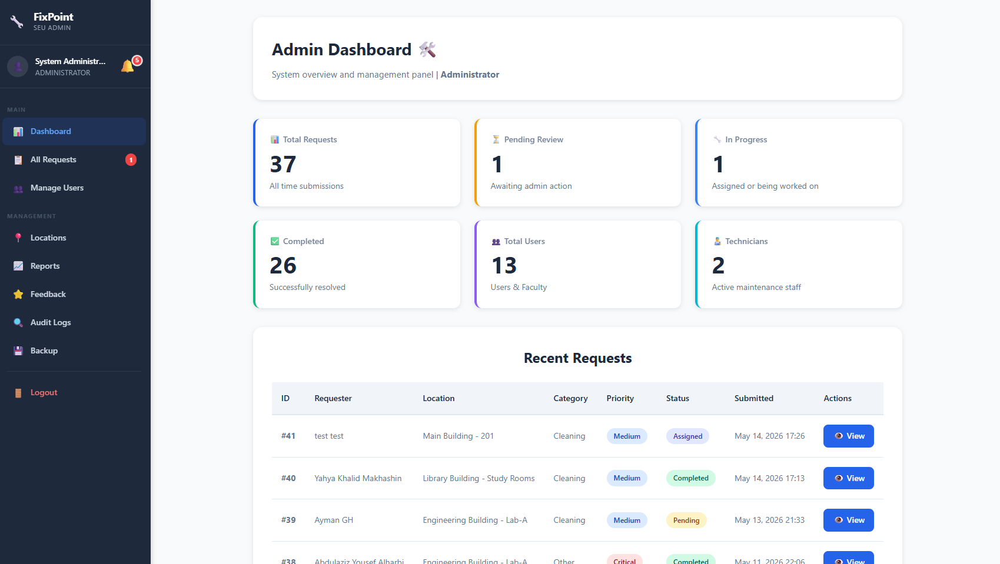
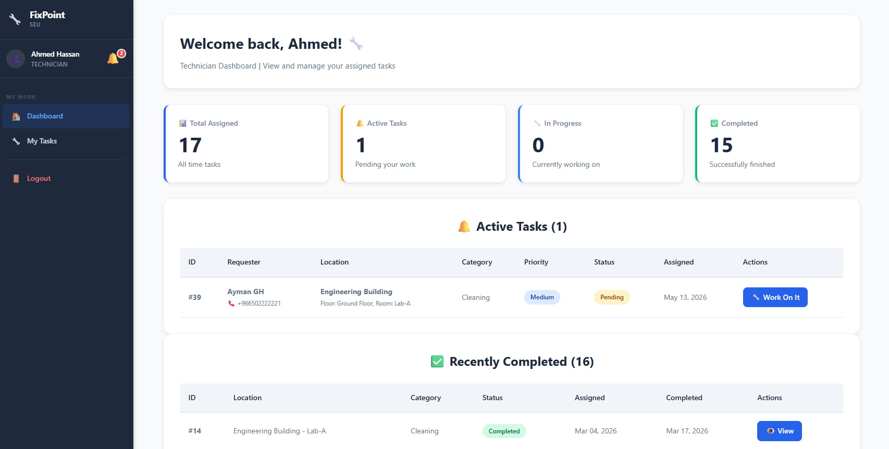

# FixPoint — Maintenance Request Management System


A web-based maintenance request management system built for university environments. FixPoint replaces traditional maintenance reporting methods, such as phone calls and paper forms, with a structured digital platform where students, faculty, and staff can submit maintenance requests with photos, track request status, and receive notifications throughout the process.

> Developed as a Senior Project graduation project at the College of Computing and Informatics, Saudi Electronic University.

---

## Table of Contents

- [About the Project](#about-the-project)
- [Objectives](#objectives)
- [Key Features](#key-features)
- [User Roles](#user-roles)
- [Tech Stack](#tech-stack)
- [System Architecture](#system-architecture)
- [Getting Started](#getting-started)
- [Project Structure](#project-structure)
- [Screenshots](#screenshots)
- [Team](#team)
- [License](#license)

---

## About the Project

Universities depend on essential infrastructure such as air conditioning, electrical systems, plumbing, projectors, laboratories, classrooms, and IT resources. These facilities require continuous maintenance to support academic activities and provide a safe and reliable campus environment.

In many institutions, maintenance requests are still handled through manual channels such as phone calls, paper forms, or direct communication with maintenance staff. These approaches can lead to delays, duplicated reports, poor tracking, and unresolved issues.

**FixPoint** addresses this problem by providing a centralized web-based platform that manages the full maintenance workflow, from submitting a request to assigning a technician and confirming completion. The system improves transparency, accountability, response time, and overall maintenance coordination across the university.

---

## Objectives

- Provide a web-based platform for submitting maintenance requests with descriptions and photos.
- Allow users to track the status of their submitted requests.
- Provide an administrative dashboard for monitoring, assigning, and managing requests.
- Enable technicians to view assigned tasks and update progress.
- Categorize requests by location, category, and priority.
- Maintain a centralized database of maintenance records and user activity.
- Support notifications, audit logs, reports, and service feedback.
- Improve efficiency, transparency, and accountability in university maintenance operations.
- Build a foundation for future preventive maintenance and smart campus features.

---

## Key Features

- **Role-based authentication** — Secure registration and login with a dedicated interface for each user role.
- **Photo-based request submission** — Users can report issues with descriptions and attached images.
- **Request status tracking** — Users can follow request progress from submission to completion.
- **Weekly request limit** — Controls the number of requests a user can submit within a weekly period.
- **Technician assignment** — Admins can assign requests to available technicians.
- **Admin dashboard** — Provides system statistics, recent requests, user management, reports, and operational control.
- **Technician dashboard** — Allows technicians to manage active and completed maintenance tasks.
- **Notifications** — Keeps users informed when requests are reviewed, assigned, updated, or completed.
- **Reports** — Helps administrators analyze maintenance activity and system performance.
- **Audit logs** — Records important system actions for accountability and security.
- **Feedback and rating** — Users can rate completed maintenance services to support continuous improvement.

---

## User Roles

| Role | Capabilities |
|------|--------------|
| **Admin** | Manage users, locations, requests, technicians, reports, audit logs, backups, and system workflow. |
| **Technician** | View assigned tasks, update task progress, complete requests, and review completed work. |
| **Student** | Submit maintenance requests, upload photos, track request status, receive notifications, and provide feedback. |
| **Faculty** | Report maintenance issues, follow request progress, receive updates, and provide service feedback. |

---

## Tech Stack

### Frontend

- **HTML5** — Page structure and semantic content.
- **CSS3** — Responsive interface styling.
- **JavaScript** — Client-side interactivity, validation, and dynamic behavior.

### Backend

- **PHP 7.4+** — Server-side logic, authentication, request processing, and session handling.
- **MySQL 8.0** — Relational database for users, requests, tasks, notifications, feedback, and logs.

### Environment and Tools

- **Apache / XAMPP** — Local development server.
- **phpMyAdmin** — Database management.
- **VS Code** — Development environment.
- **Git and GitHub** — Version control and project hosting.

### Methodology

- **Agile development** — The project was developed through iterative phases covering planning, analysis, design, implementation, testing, and refinement.

---

## System Architecture

FixPoint follows a layered web application structure:

- **Presentation Layer** — HTML, CSS, and JavaScript interfaces for users, technicians, and administrators.
- **Application Layer** — PHP scripts that handle authentication, request submission, technician assignment, notifications, reporting, and workflow logic.
- **Data Layer** — MySQL database used to store users, requests, uploaded image references, logs, reports, feedback, and related system data.

The system runs on an Apache and PHP server, communicates with a MySQL database, and organizes functionality into separate role-based areas to improve maintainability and clarity.

---

## Getting Started

### Prerequisites

Make sure you have the following installed:

- [XAMPP](https://www.apachefriends.org/) or another local environment with Apache, PHP, and MySQL.
- A modern web browser.
- Git, if you want to clone the repository.

### Installation

1. **Clone the repository**

   ```bash
   git clone https://github.com/aymangh-0/FixPoint-Maintenance-System.git
   ```

2. **Move the project to your server directory**

   If you are using XAMPP, place the project folder inside:

   ```text
   C:\xampp\htdocs\
   ```

3. **Start Apache and MySQL**

   Open the XAMPP Control Panel and start:

   - Apache
   - MySQL

4. **Create the database**

   Open phpMyAdmin, create a new database, then import the provided SQL file from the project files.

5. **Configure the database connection**

   Update the database configuration file with your local database settings.

   Example:

   ```php
   $host = "localhost";
   $username = "root";
   $password = "";
   $database = "your_database_name";
   ```

6. **Run the application**

   Open the project in your browser:

   ```text
   http://localhost/FixPoint-Maintenance-System/
   ```

   If your local folder name is different, use that folder name in the URL.

---

## Default Access

For security, this README does not include real user credentials, emails, phone numbers, or private account details.

After importing the database, you can:

- Register a new account from the sign-up page, or
- Create an administrator account directly in the database by assigning the user role as `admin`.

---

## Project Structure

```text
FixPoint-Maintenance-System/
├── admin/                  # Admin dashboard and management pages
├── auth/                   # Login, registration, and authentication handling
├── technician/             # Technician dashboard and task management
├── user/                   # User dashboard, request submission, and tracking
├── config/                 # Database and application configuration
├── includes/               # Shared components, helpers, and layout files
├── assets/
│   ├── css/                # Stylesheets
│   ├── images/             # Static images
│   ├── js/                 # JavaScript files
│   └── screenshots/        # README screenshots
├── logs/                   # Application and audit logs
├── index.php               # Landing page
├── notifications.php       # Notification handling
└── README.md
```

---

## Screenshots

The following screenshots show the main interfaces of FixPoint. Sensitive data such as emails, phone numbers, private credentials, and personal identifiers should be removed or hidden before uploading images to the repository.

### Landing Page



### User Dashboard



### Submit Request



### Admin Dashboard



### Technician Dashboard



---

## Team

Developed collaboratively as a six-member graduation project team:

- Ayman Ahmed Alghamdi
- Al-Abbas AlQurashi
- Omar Marzouq Almutairi
- Yahya Khalid Makhashin
- Talal Althubyani
- Abdulaziz Yousef Alharbi

---

## License

This repository is currently intended for academic and portfolio purposes.

If you want to make the project reusable by others, add a `LICENSE` file and update this section with the selected license type.
